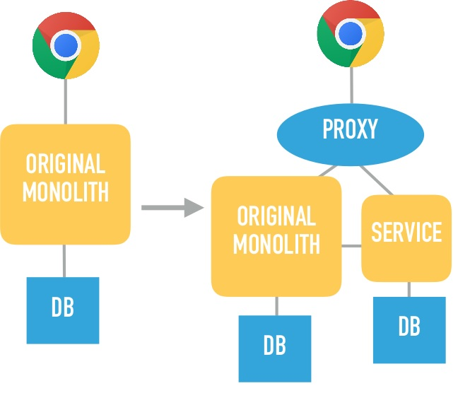
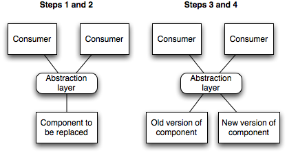

# Practice 2 from monolith to microservices

We are going to split the monolith created in the second practice of "Tecnologías de Servicios de Internet". 
That monolith manage books, comments and users.

## Phase 1 - THE MONOLITH

This is a very simple SpringBoot project to manage books, comments and users.

This app uses mysql as database, whose tables are created by hibernate in the startup.

Three self-explaining entities:

    Book
        id
        title 
        summary
        author
        publisher 
        publicationYear 
        comments (OneToMany)
    Commment
        id
        comment
        score
        book (ManyToOne)
        user (ManyToOne)
    User
        id
        nick
        email
        comments (OneToMany)


REST api to create any of the aforementioned ones in JSON format. 

### Deploy into minikube

run minikube with:

`minikube start --addons ingress --addons metallb`

go to k8s folder and do

`kubectl apply -f  .`

check the IP

`kubectl get ingress`

Add that ip to the etc/hosts

Now we can use the postman collection to query the monolith

The ingress is pointing the monolith, we will point the microservice in the next session

```
apiVersion: networking.k8s.io/v1
kind: Ingress
metadata:
  name: split-the-monolith-ingress
  annotations:
    kubernetes.io/ingress.class: "nginx"
spec:
  rules:
    - host: split-the-monolith.com
      http:
        paths:
          - path: /api/v1/books
            pathType: ImplementationSpecific
            backend:
              service:
                name: monolith
                port:
                  number : 8080
          - path: /api/v1/users
            pathType: ImplementationSpecific
            backend:
              service:
                name: monolith
                port:
                  number : 8080
```

## Phase 2 - Applying STRANGLER FIG

The goal here is to get some responsibilities out of the original monolith, so I want to extract the user management into a separate microservice.

Based on [Martin Fowler Strangler Fig post](https://martinfowler.com/bliki/StranglerFigApplication.html), we will "gradually create a new system around the edges of the old".




A proxy will still forward /books api requests to the monolith, but /users should then go to the new microservice.

Obviously, the new service will have to do some internal requests to the monolith; should handle users in an independent schema, though. **The idea is we do not need to touch or modify the monolith.**

### The new Microservice, Users

A separate SpringBoot project, containing DTOs for customer and product, and one entity User.java.

Only one REST controller for User will be created here.

The idea is, even though the implementation is different, we will get the same exception for the same use cases, so the external api remains exactly the same.

The monolith url will be set thorough an environment variable, so it's more flexible for us to set it later to a different value.

This way we have a separate microservice ready to take all /users requests.

This microservice calls the monolith in order to get the comments of a user given that the comments are in a separate table.


### The proxy, NGINX as K8s Ingress

If you are not familiar with kubernetes, the Ingress-NGINX implementation might not seem straightforward to you, but the underlying NGINX functionality is still the same. It will just forward traffic to one microservice or another depending on the path. Let's have a look at the k8s/ingress.yml:

```
apiVersion: networking.k8s.io/v1
kind: Ingress
metadata:
  name: split-the-monolith-ingress
  annotations:
    kubernetes.io/ingress.class: "nginx"
spec:
  rules:
    - host: split-the-monolith.com
      http:
        paths:
          - path: /api/v1/books
            pathType: ImplementationSpecific
            backend:
              service:
                name: monolith
                port:
                  number : 8080
          - path: /api/v1/users
            pathType: ImplementationSpecific
            backend:
              service:
                name: users
                port:
                  number : 8090
```


Monolith and users have already been declared as services running in k8s respectively in k8s/monolith.yaml amd k8s/users.yaml. I'm using minikube with Ingress addon as local dev environment, and setting split-the-monolith.com to my VM ip in my hosts file.

Please note that both services are generated with the spring boot plugin with `spring-boot:build-image` and pushed to dockerhub with `pushImage.sh` so k8s yaml images can find them somewhere.

Now is all set, functionality remains the same as in the monolith, and we have a microservice, each one taking care of a task, all behind a proxy, nice!!

## Phase 3 - Applying BRANCH BY ABSTRACTION

Would be nice to spin up the new microservice and gradually switch user management from monolith to this new service, using a [feature toggle](https://martinfowler.com/articles/feature-toggles.html).

Based on [Martin Fowler Branch by Abstraction post](https://martinfowler.com/bliki/BranchByAbstraction.html), "While we are building the new feature we can use FeatureToggles to run the new supplier in test environments and compare its behavior to the flawed supplier".




So we will do in this phase 3. We will then introduce a feature toggle in the monolith. This way, when some comment is added to the user, depending on the value of the feature toggle, the notification will get sent through the monolith implementation (still there) or through the new service (the monolith will trigger a rest call), so the new microservice takes care of this.

For us the feature toggle will just be a boolean application.property called use.users.service.

Also, we need endpoints to call the microservice and the monolith

```
    @Value(value = "${use.users.service}")
    private boolean useService;
    ------
    if (useService) {
        UserResponseDto userResponseDto = this.userServiceRest
            .findByNick(commentRequestDto.getUserNick());
        if (userResponseDto == null) {
            throw new UserNotFoundException();
        }
        comment.setId(userResponseDto.getId());
    } else {
        User user = this.userRepository.findByNick(commentRequestDto.getUserNick())
            .orElseThrow(UserNotFoundException::new);
        comment.setId(user.getId());
    }
```


This way, the k8s deployment yaml for the monolith will now contain an environment variable that will override the feature toggle value per environment:

```
    - name: USERS_SERVICE_URL
    value: http://users:8090
    - name: USE_USERS_SERVICE
    value: "true"
```

So operations will have now the option to configure whether to use this external notifications service or not from there. The idea is to reach a point where no more clients are using the original monolith notifications feature so it can be removed.