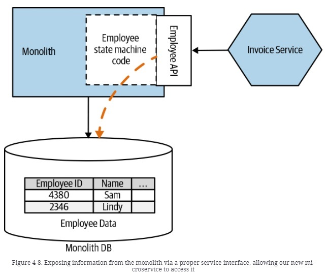

# Aggregate Exposing Monolith

## Introduction
In Figure 4-8, our new Invoicing service needs to access a variety of information that isn’t directly related to managing invoicing. At the very least, it needs information on our current Employees to manage approval workflows. This data is currently all inside the monolith database. By exposing information about our Employees via a service endpoint (it could be an API or a stream of events) on the monolith itself, we make explicit what information the Invoice service needs.

## Limitations 

- It's important to see the impact on performance of the views (cache vs online query)
- There are database engines that only support read-only views

## Where to Use It

- Should be avoided as much as possible
- There are times when other services cannot be updated to use a service and need to access directly to the database

## Our Example

This is a very simple SpringBoot project to manage customers. 

- In the v1, we have all services get data from the monolith schema:

- In the v2, we have one microservice (loyaltyService) get data from the loyalty schema through a view:

## Deployment

We are going to user a Docker compose file to deploy the examples: 

- In the v1 version we are going to deploy the database, and the v1 of the monolith and the loyalty service. Both services  will be hosted on dockerhub and will be deploy with a docker-compose file:

     version: '3.9'

        services:
        monolith:
        image: juaneb/database_view_monolith_v1
        ports:
        - 8080:8080
        environment:
        # Enviroment variables for connect to MySQL
        - MYSQL_HOST=mysql
        depends_on:
        - mysql
        restart: on-failure
    
        loyaltyservice:
        image: juaneb/database_view_loyalty_v1
        ports:
        - 8090:8090
        environment:
        - MYSQL_HOST=mysql
        restart: on-failure
    
        mysql:
        image: mysql:8.0.25
        ports:
        - 3306:3306
        environment:
        # Enviroment variables for securize MySQL and create default Database
        - MYSQL_DATABASE=monolith
        - MYSQL_ROOT_PASSWORD=pass
        volumes:  
        - ./mysql_db:/var/lib/mysql
        restart: always

- In the v2 version we are going to deploy the database, and the v2 of the monolith and the loyalty service. Both services  will be hosted on dockerhub and will be deploy with a docker-compose file:

'

    version: '3.9'
        services:
        monolith:
        image: juaneb/database_view_monolith_v2
        ports:
        - 8080:8080
        environment:
        # Enviroment variables for connect to MySQL
        - MYSQL_HOST=mysql
        depends_on:
        - mysql
        restart: on-failure
        
        loyaltyservice:
        image: juaneb/database_view_loyalty_v2
        ports:
        - 8090:8090
        environment:
        - MYSQL_HOST=mysql
        depends_on:
        - mysql
        - monolith
        restart: on-failure
        
        mysql:
        image: mysql:8.0.25
        ports:
        - 3306:3306
        environment:
        # Enviroment variables for securize MySQL and create default Database
        - MYSQL_DATABASE=monolith
        - MYSQL_ROOT_PASSWORD=pass
        volumes:
        - ./mysql_db:/var/lib/mysql
        restart: always

Both services uses mysql as database, whose tables are created by hibernate in the startup. We are going to use flyway to deploy the view in the V2 of loyalty service.

